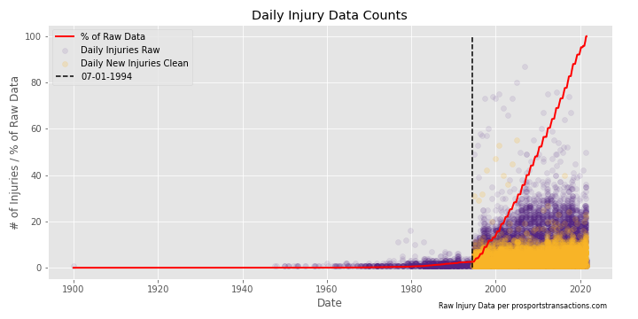

# **How Long They Out? - NBA Injury Predictor**

## **Table of Contents**

1. **Introduction**
2. **The Data and Collection Pipeline**
   - Injury Dataset
   - Basketball-Reference IDs and Game Logs
   - Technologies Used
3. **Feature Engineering**
   - Target: Injury Duration
   - Features from Notes Column
   - Features from Game Logs
   - Other Features from Injury Dataset
4. **EDA**
5. **Model Selection**

## **Introduction**

One of the major throughlines during the NBA 2020-21 Season was injuries to major players. This had me thinking about NBA injuries and inspired me to see if I could build a model that could predict how long a player would be out. The first part of this project involved an intense amount of data cleaning and feature engineering to get the dataset into a usable form to perform machine learning on.

## **The Data and Collection Pipeline**

### **Injury Dataset**

The injury dataset was collected from prosportstransactions.com (PST). [[dataset](http://prosportstransactions.com/basketball/Search/SearchResults.php?Player=&Team=&BeginDate=&EndDate=&ILChkBx=yes&InjuriesChkBx=yes&Submit=Search)]

 Typical Page of Injury Table from PST

The dataset contains 62,243 rows of injury records including:

- New Injuries/Illnesses
- Injury Updates
- Players Recovering
- Player movement to and from Injured Reserve List (IL/IR)

And 5 Columns:

- Date: Date of Injury
- Team: Team of Injured Player
- Acquired: Name of Players recovering/returning to the team
- Relinquished: Name of Player injured/leaving team
- Notes: Text information on the injury and/or status

The dataset contains injury information from 1947-48 season of the BAA (predecessor to the NBA) to present. The first date in the dataset is actually 12-30-1899 is an error and actually supposed to be 12-30-2019 (see Willie Cauley-Stein's Illness in [NBA Official NBA Injury Report 12-30-19](https://ak-static.cms.nba.com/referee/injury/Injury-Report_2019-12-30_08PM.pdf)).

Although the dataset begins in 1947, more than 97% of the data occurs after July 1 1994, the beginning of the league calender for the 1994-95 NBA season (see first plot in Feature Engineering). Therefore the final dataset only contains injuries after 07-01-1994.

### **Basketball-Reference IDs and Game Logs**

Player specific information including game logs were collected from basketball-reference.com (BBRef)

Before collecting the game logs I first needed to connect the players in the injury dataset to their unique BBRef ID. I first scraped together all players BBRef IDs and the following information:

- Player Name (Basketball Hall of Famers indicated by \*)
- BBRef ID
- NBA Career Start
- NBA Career End
- Position
- Height
- Weight
- Birth Date
- Colleges Attended

Once the BBRef IDs and player info was linked to their appropriate player in the dataset, I began to collect the career game logs for every player in the injury dataset since the beginning of the 94-95 NBA season.

### **Technologies Used**

Information from both sites were scraped using the **Requests** and BS4 (**BeautifulSoup**) python libraries. The raw HTML was stored with **MongoDB**, then the tables and info were scraped from the HTML, converted to JSON files and again stored in **MongoDB**.

## **Feature Engineering**

As can be seen from example above the dataset scraped from PST was very raw and required an extensive amount of cleaning and feature engineering to create a usable dataset for machine learning algorithms.

Visualization of daily injuries comparison between raw dataset and cleaned final dataset of just new injuries

Once the data was cleaned and features engineered the final dataset included 89 Features and 21,109 rows of new injuries from 1994-95 NBA season to present.

### **Target: Injury Duration**

In the initial dataset, most injuries do not include return dates. The injury return dates were calculated based on using the player's game log to determine when he returned to the lineup.

The injury durations were then categorized as follows:

- **Few Days**: 0-3 Days [30% of dataset]
- **Days**: 4-6 Days [16% of dataset]
- **Week**: 7-13 Days [15% of dataset]
- **Weeks**: 13-59 Days [17% of dataset]
- **Months**: 60-365 Days [4% of dataset]
- **More Than A Year**: > 365 Days [0.2% of dataset]
- **Season Ending**: Player injured and does not play again that season until the first 10 games the following season [6% of dataset]
- **Out of the NBA**: Player injured and does not play again that season and does not play in the NBA the following season for reason other than injury (i.e. retirement, playing in other leagues, and season-long suspensions) [12% of dataset]

### **Features from Notes Column**

Using the information provided in the notes column in the injury dataset, I used NLP methods to tokenize, lemmatize and stemmatize the text in the notes column to create a bag of words and term occurances and used this information to categorize like injury locations, types, conditions and situations.

Injury locations (body parts):

- **Knee** [19.3% of the dataset]
- **Ankle** [16.1% of the dataset]
- **Midsection/Hip/Groin** [11.1% of the dataset]
- **Spine/Back** [10.5% of the dataset]
- **Foot** [7.3% of the dataset]
- **Hand** [5.8% of the dataset]
- **Shoulder** [5.3% of the dataset]
- **Lower Leg** [5.2% of the dataset]
- **Head/Facial** [3.4% of the dataset]
- **Chest** [1.6% of the dataset]
- **Arm/Elbow** [1.4% of the dataset]
- **Leg** [1.3% of the dataset]
- **Heart** [0.1% of the dataset]

Injury types, conditions and situations:

- **Placed on IL/IR** [35.1% of the dataset]
- **Surgery** [4.0% of the dataset]
- **Sprain/Strain** [29.6% of the dataset]
- **Soft Tissue 1** [15.7% of the dataset]
- **Soft Tissue 2** [8.3% of the dataset]
- **Illness** [10.3% of the dataset]
- **Swell** [7.6% of the dataset]
- **Break/Fracture/Rupture** [6.5% of the dataset]
- **Rest** [3.5% of the dataset]
- **Concussion** [1.3% of the dataset]
- **Dislocation** [0.7% of the dataset]
- **Cut/Laceration** [0.2% of the dataset]

### **Features from Game Logs**

Collecting career game logs for each player in the dataset allowed me to include player performance information to gain insight into how the player was performing prior to their injury. Information included in the dataset:

- Days since last game prior to injury
- Minutes Played (MP) in last game prior to injury
- Points (PTS) in last game prior to injury
- Rebound (REB) in last game prior to injury
- Assist (AST) in last game prior to injury
- On-court plus-minus (+/-) in last game prior to injury
- MP, PTS, REB, AST, and +/- in games 7 days prior to injury
- MP, PTS, REB, AST, and +/- in games 14 days prior to injury
- MP, PTS, REB, AST, and +/- in games 30 days prior to injury
- MP, PTS, REB, AST, and +/- in games of current season prior to injury
- MP, PTS, REB, AST, and +/- in career games prior to injury

### **Other Features from the Injury Dataset**

Using the information provided in the injury dataset and player historical information, I was able to include the following features:

- Number of injuries during current season prior to current injury
- Number of career injuries prior to current injury
- Years in the NBA at time of injury
- One-hot encoding player positions Guard/Forward/Center

## **EDA**

Once the injury duration and injury type/status/location were categorized, I began to explore the data with respect of the injury duration categories.

First I looked at injuries totals for each team with respect to injury categories, and the totals made sense, with 2004 expansion team Bobcats/Hornets (when they got the name back) as the least injured and oft-injured Nets and Warriors as the most injured.

Then I looked at the injury breakdown between position classifications, and the breakdown between position makes sense with Forwards closely followed by Guards and Centers approximately half of the other positions. There are 2 guard and 2 forward positions and only center and combo positions are typically Guard-Forward and Forward-Center, rarely Guard-Forward-Center and never Guard-Center.

Next I looked at injury duration categories with respect to injury location categories and injury type categories.

Also looked at histograms of player height and weight with respect to injury duration categories, both appear to be normally distributed.

 

The histogram of player age at time of injury with respect to injury duration shows some interesting but not unexpected trends. Occurrence of injuries start to drop off as players past the age of 27 for all injury categories except for Out of the NBA which stay flat from 23 until age 30 then begins to increase until age 35.

## **Model Selection**

To be completed for capstone 3 project
